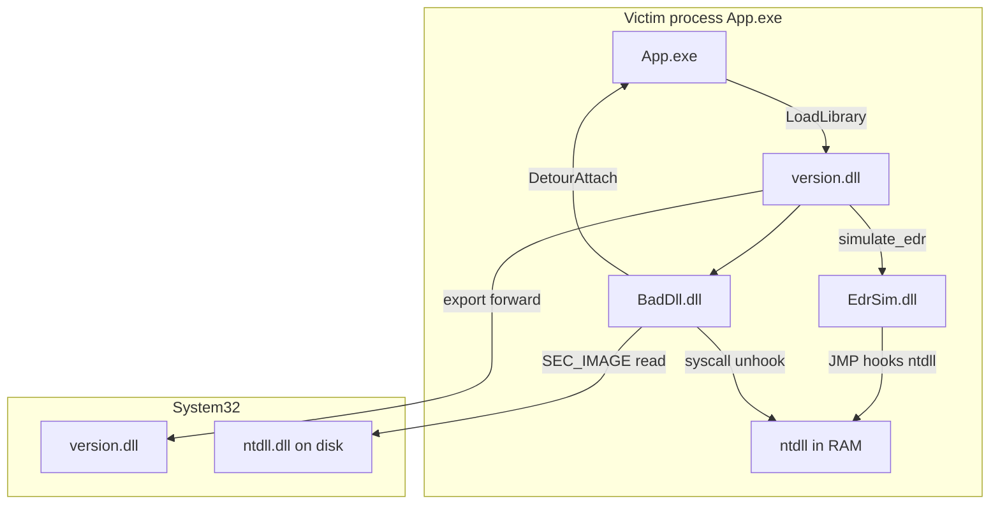

# CyberDllLab — Windows DLL Injection & EDR Evasion

A self-contained Windows stack that chains **DLL hijacking**, **remote or in-process injection**, **user-mode API hooking (Detours)**, **simulated EDR monitoring**, and **ntdll unhooking via direct syscalls** — with matching process mitigations in secure mode. The victim process is a custom `App.exe`.

---

## Table of contents

1. [Overview](#overview)
2. [Attack chain](#attack-chain)
3. [Project structure](#project-structure)
4. [Architecture](#architecture)
5. [Components](#components)
6. [Injection methods](#injection-methods)
7. [EDR simulation & unhooking](#edr-simulation--unhooking)
8. [Defense (secure mode)](#defense-secure-mode)
9. [Logging](#logging)
10. [Configuration](#configuration)
11. [Build and run](#build-and-run)
12. [Scenarios](#scenarios)
13. [Implementation notes](#implementation-notes)

---

## Overview

| Layer | Binary | Role |
| ----- | ------ | ---- |
| Victim | `App.exe` | Loads `version.dll`, exports `App_GetStatus()` for hooking |
| Loader | `version.dll` | Proxy DLL hijack; dispatches injection per config |
| Injector | `Injector.exe` | Remote `CreateRemoteThread` + `LoadLibraryW` (optional mode) |
| EDR sim | `EdrSim.dll` | Hooks ntdll stubs; integrity watchdog re-applies patches |
| Payload | `BadDll.dll` | Detours hook + reflective ntdll unhook via direct syscalls |
| Defense | `App.exe --secure` | System32-only DLL search, signature policy, ACG |

**Insecure flow (with EDR simulation enabled):**

```
App.exe → version.dll → EdrSim.dll → BadDll.dll → Detour on App_GetStatus
                              ↑              ↑
                         ntdll hooks    unhook + syscalls
                         + watchdog
```

**Secure flow:**

```
App.exe --secure → System32 version.dll only → unsigned DLLs blocked → Detours blocked
```

Set `"simulate_edr": true` in `Loader.config.json` (or run `demo.ps1 -Mode insecure-unhook`) to enable `EdrSim.dll`.

---

## Attack chain

The stack is built in three phases. Each phase is visible in log files under `deploy/`.

| Phase | Technique | Component | Evidence |
| ----- | --------- | --------- | -------- |
| 1 | DLL search-order hijacking | `version.dll` proxy | `version.log` — local path loaded |
| 2 | In-process or remote injection + Detours | `BadDll.dll` | `bad_dll.log` — detour on `App_GetStatus` |
| 3 | EDR hooks + integrity watchdog vs. syscall unhook | `EdrSim.dll` + `BadDll.dll` | `edr_sim.log`, `bad_dll.log` — `0xE9` hooks, SSN, `.text` restore |

Phase 3 models a common asymmetry: EDR patches **live ntdll in RAM**; the on-disk DLL stays clean. Unhooking maps the disk copy and overwrites the hooked `.text` section. Direct syscalls bypass usermode stubs when `NtProtectVirtualMemory` is hooked.

---

## Project structure

```
Cybersecurity/
├── App/                    # Victim executable
├── Loader/                 # version.dll + Injector.exe
├── BadDll/                 # Detours payload + ntdll unhook
├── EdrSim/                 # EDR hook simulator + watchdog
├── shared/                 # LabLogger + lab_syscalls
│   └── syscalls/           # Direct syscall stub (Hell's Gate lite)
├── cmake/BuildDetours.cmake
├── scripts/build.ps1, demo.ps1
└── deploy/                 # Runtime bundle after build
```

---

## Architecture



### Build order

1. **detours** (static lib)
2. **lab_log**, **lab_syscalls**
3. **BadDll.dll**, **EdrSim.dll**
4. **version.dll**, **Injector.exe**, **App.exe**
5. **deploy** target copies artifacts to `deploy/`

---

## Components

### App.exe (victim)

**Source:** `App/main.cpp`

| Flag | Effect |
| ---- | ------ |
| `--secure` | All mitigations enabled (default) |
| `--insecure` | Local proxy DLLs can load |
| `--demo` | Short run: 5 status lines, 2s apart |

Exports `App_GetStatus()` — returns `"OK (App.exe)"` normally, `"INJECTED (BadDll.dll)"` when hooked.

**Runtime:** parse flags → optional mitigations → `LoadLibrary("version.dll")` → wait 1.5s for injection → status loop.

---

### version.dll (Loader)

Proxy `version.dll` placed beside `App.exe`. Forwards exports to `C:\Windows\System32\version.dll` via linker pragmas. A worker thread reads `Loader.config.json` and loads `EdrSim.dll` (if enabled) then `BadDll.dll`.

**Log:** `version.log`

---

### EdrSim.dll (EDR simulator)

**Sources:** `EdrSim/src/simulate.cpp`, `EdrSim/src/watchdog.cpp`

Optional module loaded before the payload when `simulate_edr` is true.

| Feature | Behavior |
| ------- | -------- |
| ntdll hooks | `0xE9` JMP patches on `NtAllocateVirtualMemory` and `NtProtectVirtualMemory` |
| Deferred install | First hook pass runs after **2.5s** so `LoadLibrary(BadDll)` and Detours attach complete first |
| Integrity watchdog | Every **1.5s**, checks hook bytes; if tampered, logs and re-applies the JMP |

**Log:** `edr_sim.log`

---

### BadDll.dll (payload)

**Sources:** `BadDll/src/hooks.cpp`, `unhook.cpp`, `dllmain.cpp`

On attach:

1. **Detours** — hook `App_GetStatus` via `GetProcAddress` + `DetourAttach`
2. **Unhook** — map pristine `ntdll.dll` from disk, resolve SSN from clean exports, call `NtProtectVirtualMemory` via **direct syscall**, `memcpy` clean `.text` over live `.text`

Uses `shared/syscalls/` (static `lab_syscalls` lib) for syscall stub generation.

**Log:** `bad_dll.log`

---

### Injector.exe (remote mode)

**Source:** `Loader/src/injector_main.cpp`

`Injector.exe <pid> <dll_path>` — classic `OpenProcess` → `VirtualAllocEx` → `WriteProcessMemory` → `CreateRemoteThread(LoadLibraryW)`.

When `simulate_edr` is true, the Loader calls Injector twice: first `EdrSim.dll`, then `BadDll.dll`.

**Log:** `injector.log`

---

## Injection methods

### In-process (`"mode": "inprocess"`)

```
App.exe → version.dll → [EdrSim.dll] → BadDll.dll → DetourAttach
```

### Remote (`"mode": "remote"`)

```
App.exe → version.dll → Injector.exe → LoadLibraryW in target → BadDll.dll
```

---

## EDR simulation & unhooking

### What EdrSim models

User-mode EDR often patches ntdll syscall stubs in process memory (typically a 5-byte `0xE9` relative JMP). The file on disk is unchanged. EdrSim reproduces that behavior and adds an **integrity watchdog** that re-applies hooks if the stubs are restored.

### What BadDll counters with

1. **Reflective DLL overwriting** — `CreateFileMapping` + `SEC_IMAGE` on `ntdll.dll`, locate `.text`, overwrite live RAM from disk
2. **Direct syscalls** — extract syscall number (SSN) from the disk-mapped export (`mov r10, rcx; mov eax, SSN`), invoke `NtProtectVirtualMemory` without calling the hooked stub
3. **One-shot unhook** at payload load; the watchdog may re-hook on later ticks (observable arms race in logs)

### Expected log evidence (`insecure-unhook`)

| File | Look for |
| ---- | -------- |
| `bad_dll.log` | `SSN=0xXX`, `via direct syscall`, stub verification OK |
| `edr_sim.log` | `Hooked NtAllocateVirtualMemory`, `Integrity watchdog: tamper detected`, `Hook restored` |
| `app.log` | `[status] INJECTED (BadDll.dll)` |

Unhooking does **not** bypass `--secure` mitigations (ACG, Microsoft-signed-only policy).

---

## Defense (secure mode)

Run: `App.exe --secure`

Three mitigations apply **before** `LoadLibrary("version.dll")`:

| Mitigation | API | Blocks |
| ---------- | --- | ------ |
| DLL search order | `SetDefaultDllDirectories(LOAD_LIBRARY_SEARCH_SYSTEM32)` | Local proxy `version.dll` |
| Signature policy | `ProcessSignaturePolicy` / `MicrosoftSignedOnly` | Unsigned `BadDll.dll`, `EdrSim.dll` |
| Arbitrary Code Guard | `ProcessDynamicCodePolicy` / `ProhibitDynamicCode` | Detours code patching |

**Expected:** System32 `version.dll`, status `OK (App.exe)`, no successful detour.

---

## Logging

Per-component logs in `deploy/` with timestamps; mirrored to console when run from a terminal.

| Component | Log file | Notable entries |
| --------- | -------- | ----------------- |
| App.exe | `app.log` | Mode, DLL path, status loop |
| version.dll | `version.log` | Config, injection mode, `simulate_edr` |
| EdrSim.dll | `edr_sim.log` | Hook install, watchdog tamper/restore |
| BadDll.dll | `bad_dll.log` | Detour, SSN, unhook, stub bytes |
| Injector.exe | `injector.log` | Remote injection steps |

Implementation: `shared/lab_log.cpp` — `LabLogger::init("name.log")`.

`demo.ps1` prints all log files after each run.

---

## Configuration

**File:** `Loader/res/Loader.config.json` (copied to `deploy/` on build)

```json
{
  "enabled": true,
  "simulate_edr": false,
  "edr_sim": "EdrSim.dll",
  "targets": ["App.exe"],
  "mode": "inprocess",
  "payload": "BadDll.dll",
  "injector": "Injector.exe"
}
```

| Field | Description |
| ----- | ----------- |
| `enabled` | If `false`, Loader does nothing |
| `simulate_edr` | Load `EdrSim.dll` before payload |
| `edr_sim` | Path to EDR simulator DLL (relative to `version.dll`) |
| `targets` | Host EXE names to inject into |
| `mode` | `inprocess` or `remote` |
| `payload` | Payload DLL path |
| `injector` | Injector EXE for remote mode |

---

## Build and run

See [BUILD.md](BUILD.md) for prerequisites.

```powershell
.\scripts\build.ps1

.\scripts\demo.ps1 -Mode insecure-inprocess
.\scripts\demo.ps1 -Mode insecure-remote
.\scripts\demo.ps1 -Mode insecure-unhook
.\scripts\demo.ps1 -Mode secure
```

**Manual run** (from `deploy/`):

```powershell
.\App.exe --insecure --demo
```

Files beside `App.exe`: `version.dll`, `BadDll.dll`, `EdrSim.dll` (if using EDR sim), `Injector.exe` (remote), `Loader.config.json`.

---

## Scenarios

| Command | Mode | `version.dll` path | Expected status |
| ------- | ---- | ------------------ | --------------- |
| `demo.ps1 -Mode insecure` (alias) | inprocess | `deploy\version.dll` | `INJECTED (BadDll.dll)` |
| `demo.ps1 -Mode insecure-inprocess` | inprocess | `deploy\version.dll` | `INJECTED (BadDll.dll)` |
| `demo.ps1 -Mode insecure-remote` | remote | `deploy\version.dll` | `INJECTED (BadDll.dll)` |
| `demo.ps1 -Mode insecure-unhook` | inprocess + EDR | `deploy\version.dll` | `INJECTED` + EDR/unhook logs |
| `demo.ps1 -Mode secure` | inprocess | `System32\version.dll` | `OK (App.exe)` |

---

## Implementation notes

### Detours

Built from `third_party/microsoft-detours` via `cmake/BuildDetours.cmake`. Hook pattern:

```cpp
DetourTransactionBegin();
DetourUpdateThread(GetCurrentThread());
DetourAttach(&(PVOID&)g_real_app_get_status, Hook_App_GetStatus);
DetourTransactionCommit();
```

ACG in secure mode blocks the writable-then-executable page flips Detours requires. Toolchain: MinGW primary; see [BUILD.md](BUILD.md) for MSVC fallback.

### Why `App_GetStatus` is exported

Detours needs a stable symbol in the victim. `GetProcAddress` on an exported function avoids guessing addresses.

### Loader threading

`DllMain` spawns a worker thread for `loader::init()` — config, target check, and injection must not block the loader lock.

### JSON config

`config.cpp` uses a minimal hand-written parser (no external JSON library).

---

## Key source files

| File | Role |
| ---- | ---- |
| [App/main.cpp](App/main.cpp) | Victim, mitigations, status loop |
| [Loader/src/loader.cpp](Loader/src/loader.cpp) | Injection + EdrSim dispatch |
| [Loader/src/injector_main.cpp](Loader/src/injector_main.cpp) | Remote injector |
| [EdrSim/src/simulate.cpp](EdrSim/src/simulate.cpp) | ntdll JMP hooks |
| [EdrSim/src/watchdog.cpp](EdrSim/src/watchdog.cpp) | Integrity watchdog thread |
| [BadDll/src/hooks.cpp](BadDll/src/hooks.cpp) | Detours hook |
| [BadDll/src/unhook.cpp](BadDll/src/unhook.cpp) | Reflective unhook + syscalls |
| [shared/syscalls/syscall.cpp](shared/syscalls/syscall.cpp) | SSN extraction, syscall stub |
| [shared/lab_log.cpp](shared/lab_log.cpp) | File + console logging |
| [cmake/BuildDetours.cmake](cmake/BuildDetours.cmake) | Detours static library |
