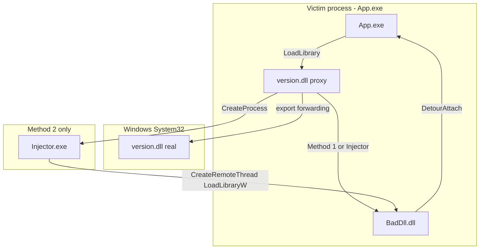
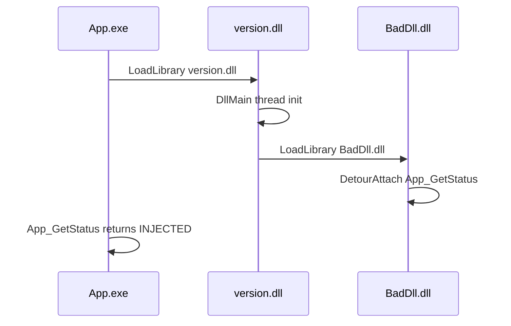
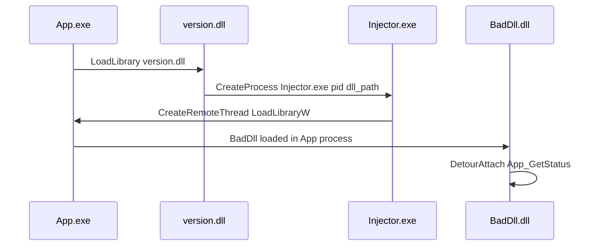

# DLL Injection Lab — Project Documentation

A Windows security lab for a school project: demonstrate **DLL hijacking**, **two injection techniques**, **Microsoft Detours hooking**, and **process mitigations** that defend against them. The victim application is a custom `App.exe`.

---

## Table of contents

1. [Overview](#overview)
2. [Project structure](#project-structure)
3. [Architecture](#architecture)
4. [Components](#components)
5. [Injection methods](#injection-methods)
6. [Defense (secure mode)](#defense-secure-mode)
7. [Microsoft Detours payload](#microsoft-detours-payload)
8. [Logging](#logging)
9. [Configuration](#configuration)
10. [Build and run](#build-and-run)
11. [Demo matrix](#demo-matrix)
12. [Implementation details](#implementation-details)

---

## Overview


| Goal               | Implementation                                                         |
| ------------------ | ---------------------------------------------------------------------- |
| Victim application | `App.exe` — loads `version.dll`, exports `App_GetStatus()` for hooking |
| Attack vector 1    | Proxy `version.dll` (Loader) hijacks DLL search order                  |
| Attack vector 2    | Same proxy spawns `Injector.exe` for remote `LoadLibrary`              |
| Payload            | `BadDll.dll` — hooks `App_GetStatus` with **Microsoft Detours**        |
| Phase 3 (EDR)      | `EdrSim.dll` hooks ntdll + integrity watchdog; `BadDll.dll` unhooks via syscalls + disk `.text` overwrite |
| Defense            | `App.exe --secure` — System32-only DLL search, signature policy, ACG   |


**Attack flow (simplified):**

```
App.exe  →  loads local version.dll  →  Loader runs  →  [EdrSim.dll]  →  BadDll.dll  →  ntdll unhook  →  Detour on App_GetStatus
```

(`EdrSim.dll` loads only when `simulate_edr` is `true` in `Loader.config.json`.)

**Defense flow:**

```
App.exe --secure  →  ignores local version.dll  →  System32 DLL only  →  unsigned DLLs blocked  →  detours blocked
```

---

## Project structure

```
Cyber/
├── App/                    # Victim executable
│   └── main.cpp
├── Loader/                 # Built as version.dll (proxy hijacker)
│   ├── src/
│   │   ├── dllmain.cpp
│   │   ├── loader.cpp
│   │   ├── config.cpp
│   │   ├── exports_forward.cpp
│   │   └── injector_main.cpp   # Injector.exe source
│   └── res/
│       └── Loader.config.json
├── BadDll/                 # Detours payload DLL + ntdll unhook
│   ├── include/
│   │   └── unhook.hpp
│   └── src/
│       ├── dllmain.cpp
│       ├── hooks.cpp
│       └── unhook.cpp
├── EdrSim/                 # Optional EDR hook simulator
│   ├── include/
│   │   └── simulate.hpp
│   └── src/
│       ├── dllmain.cpp
│       └── simulate.cpp
├── shared/                 # Shared logging library
│   ├── lab_log.h
│   └── lab_log.cpp
├── cmake/
│   └── BuildDetours.cmake  # Builds Microsoft Detours static lib
├── third_party/
│   └── microsoft-detours/  # Cloned on first build
├── scripts/
│   ├── build.ps1
│   └── demo.ps1
├── deploy/                 # Runtime bundle (after build)
│   ├── App.exe
│   ├── version.dll
│   ├── BadDll.dll
│   ├── EdrSim.dll
│   ├── Injector.exe
│   ├── Loader.config.json
│   └── *.log
├── CMakeLists.txt          # Root build + deploy target
├── BUILD.md                # Short build reference
└── README.md               # This file
```

---

## Architecture




### Build dependency order

1. **detours** (static lib from Microsoft Detours sources)
2. **lab_log** (shared logging)
3. **BadDll.dll** (links detours + lab_log)
4. **version.dll** + **Injector.exe** (links lab_log)
5. **App.exe** (links lab_log)
6. **deploy** target copies everything into `deploy/`

---

## Components

### 1. App.exe (victim)

**Source:** `App/main.cpp`

The application that can run in two modes:


| Flag         | Effect                                     |
| ------------ | ------------------------------------------ |
| `--secure`   | Enables all mitigations (default)          |
| `--insecure` | Vulnerable — local proxy DLLs can load     |
| `--demo`     | Short run: 5 status lines, 2 seconds apart |


**Exported function** (hook target for BadDll):

```cpp
extern "C" __declspec(dllexport) const char* App_GetStatus();
```

- Normal return: `"OK (App.exe)"`
- After hook: `"INJECTED (BadDll.dll)"`

**Runtime behavior:**

1. Parse CLI flags and log to `app.log`
2. If secure: apply mitigations (see [Defense](#defense-secure-mode))
3. `LoadLibraryA("version.dll")` — triggers hijack when insecure
4. Wait 1.5s for Loader thread / injection
5. Print `App_GetStatus()` in a loop (proves hook worked)

---

### 2. version.dll (Loader — proxy hijacker)

**CMake target:** `version` (output name `version.dll`, not `Loader.dll`)

**Sources:**


| File                  | Purpose                                                          |
| --------------------- | ---------------------------------------------------------------- |
| `dllmain.cpp`         | `DllMain` → `CreateThread` → `loader::init()`                    |
| `loader.cpp`          | Config, target filter, injection dispatch                        |
| `config.cpp`          | Minimal JSON parser for `Loader.config.json`                     |
| `exports_forward.cpp` | Linker pragmas forwarding exports to real System32 `version.dll` |


**Why a proxy DLL?**

Windows searches the application directory before System32. Placing a fake `version.dll` next to `App.exe` causes the app to load our DLL first. Our DLL must forward all real `version.dll` exports to `C:\Windows\System32\version.dll` so the app still works.

**Export forwarding** uses `#pragma comment(linker, "/export:...")` (MinGW-compatible). Example:

```cpp
#pragma comment(linker, "/export:GetFileVersionInfoA=C:/Windows/System32/version.GetFileVersionInfoA")
```

**Log file:** `version.log`

---

### 3. BadDll.dll (payload)

**Source:** `BadDll/src/hooks.cpp`, `BadDll/src/dllmain.cpp`

Loaded by the Loader (in-process or via Injector). Uses **Microsoft Detours** to hook `App_GetStatus`:

1. `GetModuleHandle(L"App.exe")` + `GetProcAddress("App_GetStatus")`
2. `DetourTransactionBegin` / `DetourAttach` / `DetourTransactionCommit`
3. Hook function returns `"INJECTED (BadDll.dll)"`

On `DLL_PROCESS_DETACH`, detours are removed cleanly.

**Log file:** `bad_dll.log`

---

### 4. Injector.exe (remote injector)

**Source:** `Loader/src/injector_main.cpp`

Used only when `Loader.config.json` has `"mode": "remote"`.

**Usage:**

```
Injector.exe <target_pid> <full_path_to_dll>
```

**Steps:**

1. `OpenProcess` on target PID
2. `VirtualAllocEx` — allocate memory in target for DLL path (wide string)
3. `WriteProcessMemory` — write path into target
4. `CreateRemoteThread` — start `LoadLibraryW` in target process
5. Wait for thread; check module handle return value

**Log file:** `injector.log` (only written when Injector runs)

---

## Injection methods

### Method 1 — In-process (`"mode": "inprocess"`)




All code runs inside the same process. This is the classic DLL hijack + payload pattern (similar in concept to Koaloader in the reference `example/` tree, but custom and minimal).

### Method 2 — Remote (`"mode": "remote"`)




The proxy DLL does not call `LoadLibrary` on the payload itself; it spawns `Injector.exe` to inject from outside using the standard remote-thread technique (similar in concept to Koalinjector in `example/`).

---

## Defense (secure mode)

Run: `App.exe --secure`

Three Windows process mitigations are applied **before** `LoadLibrary("version.dll")`:


| Mitigation                     | API                                                                               | What it blocks                                                                                              |
| ------------------------------ | --------------------------------------------------------------------------------- | ----------------------------------------------------------------------------------------------------------- |
| **DLL search order**           | `SetDefaultDllDirectories(LOAD_LIBRARY_SEARCH_SYSTEM32)`                          | Local proxy `version.dll` in `deploy/` is ignored; only System32 is searched                                |
| **Signature policy**           | `SetProcessMitigationPolicy(ProcessSignaturePolicy)` with `MicrosoftSignedOnly`   | Unsigned `BadDll.dll` cannot load even if injection is attempted                                            |
| **Arbitrary Code Guard (ACG)** | `SetProcessMitigationPolicy(ProcessDynamicCodePolicy)` with `ProhibitDynamicCode` | Cannot modify executable code pages — **Microsoft Detours** fails because it needs `VirtualProtect` on code |


**Expected secure behavior:**

- `version.dll` path contains `SYSTEM32`
- Status lines show `OK (App.exe)` — never `INJECTED`
- `bad_dll.log` may be missing or show failed attach

---

## Microsoft Detours payload

Detours is built from source in `third_party/microsoft-detours` via `cmake/BuildDetours.cmake` as a static library linked into `BadDll.dll`.

**Hook installation (conceptual):**

```cpp
DetourTransactionBegin();
DetourUpdateThread(GetCurrentThread());
DetourAttach(&(PVOID&)g_real_app_get_status, Hook_App_GetStatus);
DetourTransactionCommit();
```

**Why Detours?** The course requires demonstrating inline detours / trampolines. ACG in secure mode specifically targets this class of attack (writable-then-executable code patches).

**Toolchain note:** Detours officially targets MSVC (`nmake`). This project compiles Detours with **MinGW g++** via CMake. If linking fails, see [BUILD.md](BUILD.md) for an MSVC fallback.

---

## Logging

Every component writes to its own log file in the **same directory as the executable** (typically `deploy/`), with timestamps. Messages are also mirrored to the console when launched from a terminal.


| Component    | Log file       | Example entries                                   |
| ------------ | -------------- | ------------------------------------------------- |
| App.exe      | `app.log`      | Mode, mitigations, version.dll path, status loop  |
| version.dll  | `version.log`  | Config path, injection mode, LoadLibrary result   |
| BadDll.dll   | `bad_dll.log`  | Detour address, attach/detach result              |
| Injector.exe | `injector.log` | OpenProcess, VirtualAllocEx, remote thread result |


**Shared implementation:** `shared/lab_log.cpp` — `LabLogger::init("name.log")` resolves the log path next to the host EXE or DLL module.

After `demo.ps1` finishes, all existing log files are printed to the terminal automatically.

---

## Configuration

**File:** `Loader/res/Loader.config.json` (copied to `deploy/` on build)

```json
{
  "enabled": true,
  "simulate_edr": false,
  "edr_sim": "EdrSim.dll",
  "targets": ["App.exe"],
  "mode": "inprocess",
  "payload": "BadDll.dll",
  "injector": "Injector.exe"
}
```


| Field          | Description                                              |
| -------------- | -------------------------------------------------------- |
| `enabled`      | If `false`, Loader does nothing                          |
| `simulate_edr` | If `true`, load `EdrSim.dll` before payload (Phase 3 demo) |
| `edr_sim`      | EDR simulator DLL path relative to `version.dll`         |
| `targets`      | Host EXE names to inject into (empty = all processes)    |
| `mode`         | `"inprocess"` or `"remote"`                              |
| `payload`      | DLL filename or path relative to `version.dll` directory |
| `injector`     | EXE used for remote mode                                 |


`demo.ps1` updates `mode` automatically per demo scenario.

---

## Build and run

See [BUILD.md](BUILD.md) for prerequisites and troubleshooting.

```powershell
# From Cyber/ repository root
.\scripts\build.ps1

# Demos (run from anywhere; script uses deploy/)
.\scripts\demo.ps1 -Mode insecure-inprocess
.\scripts\demo.ps1 -Mode insecure-remote
.\scripts\demo.ps1 -Mode secure
```

**Manual run** (from `deploy/`):

```powershell
cd deploy
.\App.exe --insecure --demo
```

Ensure these files sit **next to** `App.exe`:

- `version.dll`
- `BadDll.dll`
- `Injector.exe` (remote mode only)
- `Loader.config.json`

---

## Demo matrix


| Command                             | Loader mode | Expected `version.dll` path       | Expected status         |
| ----------------------------------- | ----------- | --------------------------------- | ----------------------- |
| `demo.ps1 -Mode insecure-inprocess` | inprocess   | `deploy\version.dll`              | `INJECTED (BadDll.dll)` |
| `demo.ps1 -Mode insecure-remote`    | remote      | `deploy\version.dll`              | `INJECTED (BadDll.dll)` |
| `demo.ps1 -Mode insecure-unhook`    | inprocess   | `deploy\version.dll`              | `INJECTED` + syscall unhook + watchdog re-hook logs |
| `demo.ps1 -Mode secure`             | inprocess   | `C:\Windows\System32\version.dll` | `OK (App.exe)`          |


Use **Process Explorer** or the log files for screenshots in your report.

---

## Implementation details

### DLL hijacking (Phase 1)

Windows DLL search order for desktop apps traditionally checks the application directory before System32. An attacker drops a malicious DLL with the same name as a dependency (`version.dll`). When the victim calls `LoadLibrary("version.dll")`, the malicious copy loads first.

**Defense:** `SetDefaultDllDirectories(LOAD_LIBRARY_SEARCH_SYSTEM32)` restricts loading so only System32 (and explicitly added directories) are used.

### Code injection / detours (Phase 2)

After the payload DLL loads, it patches `App_GetStatus` in memory. Detours saves the original bytes, writes a trampoline, and redirects execution to the hook.

**Defense:** ACG (`ProhibitDynamicCode`) prevents marking code pages writable and executable, which breaks Detours and similar hook frameworks.

### EDR unhooking (Phase 3)

EDR products often hook ntdll syscall stubs in process memory (e.g. a `0xE9` JMP redirect). They typically do not modify the on-disk DLL.

**EdrSim.dll** (optional) simulates a stronger EDR:

- Defers JMP hooks until the **first watchdog tick** (2.5s) so `LoadLibrary(BadDll.dll)` and Detours attach are not broken
- Then hooks `NtAllocateVirtualMemory` and `NtProtectVirtualMemory`
- Runs an **integrity watchdog** every **1.5s** thereafter that detects tampered hook bytes and re-applies the JMP patch

**BadDll.dll** counters with:

1. Installs Detours on `App_GetStatus` first (while ntdll is still clean)
2. Opens pristine `ntdll.dll` from disk via `CreateFileMapping` + `SEC_IMAGE`
3. Resolves **syscall numbers (SSN)** from the disk copy (Hell's Gate lite)
4. Calls **`NtProtectVirtualMemory` via direct syscall** (bypasses usermode hooks once installed)
5. `memcpy` clean `.text` over hooked live `.text`
6. Logs stub bytes before/after for verification

Run with `demo.ps1 -Mode insecure-unhook` or set `"simulate_edr": true` in config.

**Arms race (expected logs):**

- `bad_dll.log`: `SSN=0xXX`, `via direct syscall`, stub verification OK
- `edr_sim.log`: at ~2.5s, `Hooked NtAllocateVirtualMemory` / `NtProtectVirtualMemory`; later ticks log `Integrity watchdog: tamper detected` if stubs are restored again
- `app.log`: `INJECTED (BadDll.dll)` throughout the status loop

**Note:** EDR hooks are deferred 2.5s so the payload can load; unhook runs immediately after Detours attach. The watchdog re-hooks on subsequent ticks if `.text` is tampered again. This does not bypass ACG or Microsoft-signed-only policy in `--secure` mode.

### Why `App_GetStatus` is exported

Detours needs a stable function pointer in the victim. Exporting a function from `App.exe` gives BadDll a reliable symbol to resolve with `GetProcAddress`, without guessing addresses or scanning memory.

### Threading in Loader

`DllMain` must not block or call complex APIs. Loader spawns a worker thread (`CreateThread`) that runs `loader::init()` — config load, target check, and injection.

### JSON config without external libraries

`config.cpp` uses a small hand-written parser (string search for keys) to avoid pulling in nlohmann/json or similar. Sufficient for the fixed config schema.

---

## Quick reference — key source files


| File                                                         | Role                             |
| ------------------------------------------------------------ | -------------------------------- |
| [App/main.cpp](App/main.cpp)                                 | Victim, mitigations, status loop |
| [Loader/src/loader.cpp](Loader/src/loader.cpp)               | Injection logic                  |
| [Loader/src/injector_main.cpp](Loader/src/injector_main.cpp) | Remote injector                  |
| [BadDll/src/hooks.cpp](BadDll/src/hooks.cpp)                 | Detours hook                     |
| [BadDll/src/unhook.cpp](BadDll/src/unhook.cpp)               | ntdll reflective unhook + syscalls |
| [shared/syscalls/syscall.cpp](shared/syscalls/syscall.cpp)   | Direct syscall stub generation   |
| [EdrSim/src/simulate.cpp](EdrSim/src/simulate.cpp)             | EDR hook simulator               |
| [EdrSim/src/watchdog.cpp](EdrSim/src/watchdog.cpp)             | Integrity watchdog thread        |
| [shared/lab_log.cpp](shared/lab_log.cpp)                     | File + console logging           |
| [cmake/BuildDetours.cmake](cmake/BuildDetours.cmake)         | Detours static library           |


